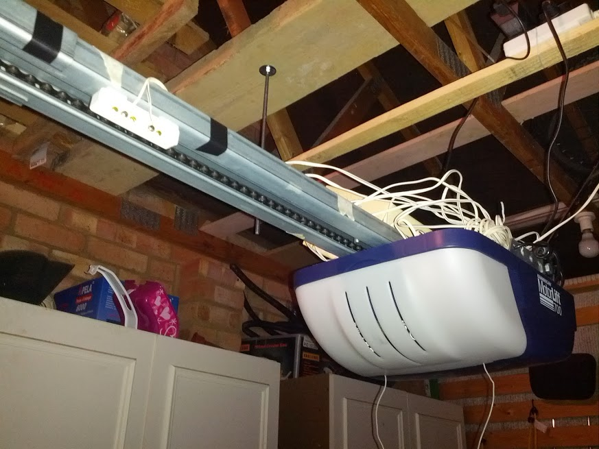
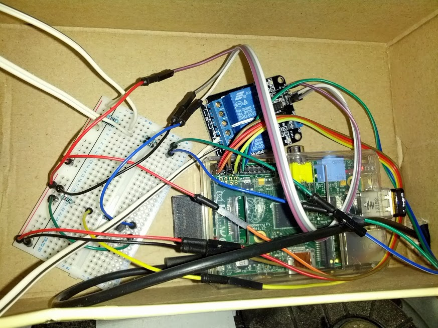

I'm no expert at electronics - these designs came from several iterations based on how they performed and also from various web forums (e.g. see [here](http://www.raspberrypi.org/phpBB3/viewtopic.php?t=19222) ).

It has been used with a Chamberlain garage door opener.

##Circuit Diagram

On the left is the relay circuit - The transistor ([BC547C](http://www.maplin.co.uk/p/bc547c-low-power-npn-transistor-to92-case-qq14q)) is used since relay requires 5V to operate the optocoupler and the switchable GPIO ports only supply 3.3V.
The relay operates a circuit (not shown) which is connected to the same points as the wall switch provided with the garage door opener.

On the right is the sensor circuit.  There are actually 2 of these, 1 to sense door opened and another to sense door closed.  You can choose where these go - I put sensors on the rail and 1 magnet on the slider.

The first atttempt at this followed instructions from [this video](http://www.youtube.com/watch?v=b6ZagKRnRdM), however, the 3.3v GPIO wasn't sufficient for the optocoupler in the relay I had which simply meant it did nothing. As mentioned above, I ended up using the Pi's 5V for both Vcc and JD-Vcc in conjunction with a transistor linked to the 3.3V GPIO port which worked perfectly.

Even though R-Pi has software-enabled pull-down resistors I found it wasn't always reliable so I included physical 10k pull-down resistors in both circuits.

##Relay

[http://www.sainsmart.com/arduino-pro-mini.html](SainSmart 2-Channel 5V Relay Module)

[Amazon UK](http://www.amazon.co.uk/gp/product/B005WR753Q)

##Sensors

Very cheap magnetic reed switch from ebay (e.g. alarm window sensor)

##Photos

The 'opened' sensor - white block top left (closed sensor is further down the rail).  Door opener with shoe box on top containing Pi.

Inside the shoe box - breadboard, relay and Pi.

###TODO
* how Pi ports relate to config file
