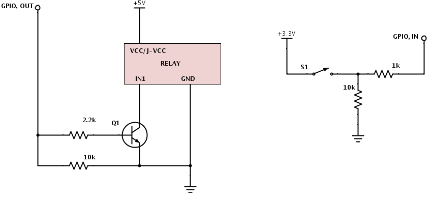

I'm no expert at electronics - these designs came from several iterations based on how they performed and also from various web forums (e.g. see [here](http://www.raspberrypi.org/phpBB3/viewtopic.php?t=19222) ).

It has been used with a Chamberlain garage door opener.

##Circuit Diagram

On the left is the relay circuit - Transistor is used since relay requires 5V to operate the optocoupler and the switchable GPIO ports only supply 3.3V.
The relay operates a circuit (not shown) which is connected to the same points as the wall switch provided with the garage door opener.

On the right is the sensor circuit.  There are actually 2 of these, 1 to sense door opened and another to sense door closed.  You can choose where these go - I put sensors on the rail and 1 magnet on the slider.

##Relay

[http://www.sainsmart.com/arduino-pro-mini.html](SainSmart 2-Channel 5V Relay Module)

[Amazon UK](http://www.amazon.co.uk/gp/product/B005WR753Q)

##Sensors

Very cheap magnetic reed switch from ebay (e.g. alarm window sensor)

###TODO
* Photo from built system
* how Pi ports relate to config file
